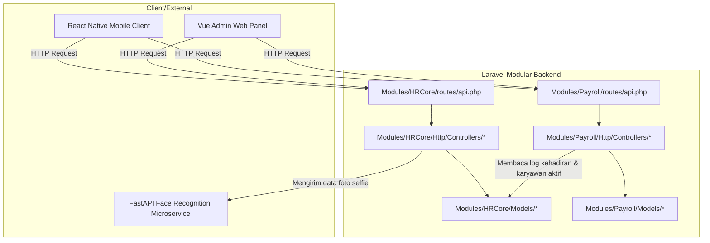

# Context Map: Modular ERP (HR Core Focus)

Dokumen ini memetakan relasi antara kebutuhan bisnis (PRD/Desain) yang didefinisikan di dalam folder [docs](file:///c:/laragon/www/ERP/docs) dengan implementasi kode aktual pada modul [HRCore](file:///c:/laragon/www/ERP/Modules/HRCore) dan [Payroll](file:///c:/laragon/www/ERP/Modules/Payroll).

---

## 🗺️ Peta Keterkaitan Dokumen vs Implementasi Kode

| Fitur / Modul | Dokumen Desain & PRD | Berkas Model (Eloquent) | Berkas Controller | Berkas Migrasi Database |
| :--- | :--- | :--- | :--- | :--- |
| **Auth & Departments** | [roles_permissions.md](file:///c:/laragon/www/ERP/docs/roles_permissions.md) | [User.php](file:///c:/laragon/www/ERP/app/Models/User.php) [Department.php](file:///c:/laragon/www/ERP/Modules/HRCore/app/Models/Department.php) | `AuthController.php` `DepartmentController.php` | `0001_01_01_000000_create_users_table.php` `2026_08_06_044159_create_departments_table.php` |
| **Kepegawaian & Jabatan** | [project_summary.md](file:///c:/laragon/www/ERP/docs/project_summary.md) | [Employee.php](file:///c:/laragon/www/ERP/Modules/HRCore/app/Models/Employee.php) [Position.php](file:///c:/laragon/www/ERP/Modules/HRCore/app/Models/Position.php) | `EmployeeController.php` `PositionController.php` | `2026_08_06_044206_create_positions_table.php` `2026_08_06_044214_create_employees_table.php` |
| **Kontrak Karyawan** | [project_summary.md](file:///c:/laragon/www/ERP/docs/project_summary.md) | [EmployeeContract.php](file:///c:/laragon/www/ERP/Modules/HRCore/app/Models/EmployeeContract.php) | `EmployeeContractController.php` | `2026_08_06_061856_create_employee_contracts_table.php` |
| **Kehadiran & Absensi** | [prd_attendance.md](file:///c:/laragon/www/ERP/docs/prd_attendance.md) [api_contract_sprint2.md](file:///c:/laragon/www/ERP/docs/api_contract_sprint2.md) [api_contract_fastapi.md](file:///c:/laragon/www/ERP/docs/api_contract_fastapi.md) | [Attendance.php](file:///c:/laragon/www/ERP/Modules/HRCore/app/Models/Attendance.php) | `AttendanceController.php` | `2026_08_06_061903_create_attendances_table.php` `2026_08_06_065139_add_roster_fields_to_attendances_table.php` |
| **Manajemen Cuti & Izin**| [prd_leave.md](file:///c:/laragon/www/ERP/docs/prd_leave.md) | [LeaveRequest.php](file:///c:/laragon/www/ERP/Modules/HRCore/app/Models/LeaveRequest.php) [LeaveType.php](file:///c:/laragon/www/ERP/Modules/HRCore/app/Models/LeaveType.php) [EmployeeLeaveBalance.php](file:///c:/laragon/www/ERP/Modules/HRCore/app/Models/EmployeeLeaveBalance.php) | `LeaveRequestController.php` `LeaveTypeController.php` | `2026_08_06_062609_create_leave_types_table.php` `2026_08_06_062618_create_employee_leave_balances_table.php` `2026_08_06_062626_create_leave_requests_table.php` |
| **Manajemen Shift / Roster**| [prd_shift_management.md](file:///c:/laragon/www/ERP/docs/prd_shift_management.md) | [Shift.php](file:///c:/laragon/www/ERP/Modules/HRCore/app/Models/Shift.php) [Roster.php](file:///c:/laragon/www/ERP/Modules/HRCore/app/Models/Roster.php) [ShiftSwap.php](file:///c:/laragon/www/ERP/Modules/HRCore/app/Models/ShiftSwap.php) | `ShiftController.php` `RosterController.php` `ShiftSwapController.php` | `2026_08_06_064952_create_shifts_table.php` `2026_08_06_064958_create_rosters_table.php` `2026_08_06_065004_create_shift_swaps_table.php` |
| **Lembur (Overtime)** | [prd_overtime.md](file:///c:/laragon/www/ERP/docs/prd_overtime.md) | [OvertimeRequest.php](file:///c:/laragon/www/ERP/Modules/HRCore/app/Models/OvertimeRequest.php) | `OvertimeController.php` | `2026_08_06_071927_create_overtime_requests_table.php` |
| **Evaluasi Performa** | [prd_performance.md](file:///c:/laragon/www/ERP/docs/prd_performance.md) | [PerformancePeriod.php](file:///c:/laragon/www/ERP/Modules/HRCore/app/Models/PerformancePeriod.php) [PerformanceReview.php](file:///c:/laragon/www/ERP/Modules/HRCore/app/Models/PerformanceReview.php) | `PerformanceController.php` | `2026_08_06_074619_create_performance_periods_table.php` `2026_08_06_074627_create_performance_reviews_table.php` |
| **Rekrutmen & Lowongan** | [prd_recruitment.md](file:///c:/laragon/www/ERP/docs/prd_recruitment.md) | [JobVacancy.php](file:///c:/laragon/www/ERP/Modules/HRCore/app/Models/JobVacancy.php) [Candidate.php](file:///c:/laragon/www/ERP/Modules/HRCore/app/Models/Candidate.php) [Interview.php](file:///c:/laragon/www/ERP/Modules/HRCore/app/Models/Interview.php) | `RecruitmentController.php` | `2026_08_06_075818_create_job_vacancies_table.php` `2026_08_06_075825_create_candidates_table.php` `2026_08_06_075851_create_interviews_table.php` |
| **Manajemen Aset (Asset)** | [prd_asset.md](file:///c:/laragon/www/ERP/docs/prd_asset.md) [api_contract_assets.md](file:///c:/laragon/www/ERP/docs/api_contract_assets.md) | [Asset.php](file:///c:/laragon/www/ERP/Modules/HRCore/app/Models/Asset.php) [AssetAssignment.php](file:///c:/laragon/www/ERP/Modules/HRCore/app/Models/AssetAssignment.php) [AssetDamageReport.php](file:///c:/laragon/www/ERP/Modules/HRCore/app/Models/AssetDamageReport.php) | `AssetController.php` | `2026_08_06_080000_create_assets_table.php` `2026_08_06_080010_create_asset_assignments_table.php` `2026_08_06_080020_create_asset_damage_reports_table.php` |
| **Penggajian (Payroll)** | [prd_payroll.md](file:///c:/laragon/www/ERP/docs/prd_payroll.md) | [SalaryComponent.php](file:///c:/laragon/www/ERP/Modules/Payroll/app/Models/SalaryComponent.php) [EmployeeSalary.php](file:///c:/laragon/www/ERP/Modules/Payroll/app/Models/EmployeeSalary.php) [PayrollRun.php](file:///c:/laragon/www/ERP/Modules/Payroll/app/Models/PayrollRun.php) [PayrollSlip.php](file:///c:/laragon/www/ERP/Modules/Payroll/app/Models/PayrollSlip.php) | `PayrollController.php` `SalaryComponentController.php` `EmployeeSalaryController.php` | [Payroll migrations](file:///c:/laragon/www/ERP/Modules/Payroll/database/migrations) |

---

## ⛓️ Peta Struktur & Alur Ketergantungan (Dependency Map)

---

## 🧪 Status & Rencana Rilis Pengujian (Tests)

* **Unit/Feature Tests**: Saat ini terdapat file pengujian untuk modul payroll di [PayrollTest.php](file:///c:/laragon/www/ERP/tests/Feature/PayrollTest.php).
* **Rencana Pengujian**:
  1. Integrasi API Absensi dengan Geofencing.
  2. Pengujian integrasi Client Laravel ke FastAPI Face Recognition.
  3. Alur persetujuan Cuti (*Leave approval workflow*).

---

## ⚠️ Risk Assessment
- **Breaking changes to public API**: Rendah (semua API memiliki versi di `/v1/`).
- **Database migrations needed**: Semua migration dasar UUID untuk modul HR dan Payroll sudah berhasil dibuat.
- **Configuration changes required**: Konfigurasi database UUID harus disinkronkan dengan library Laravel Sanctum & Spatie Permission.
