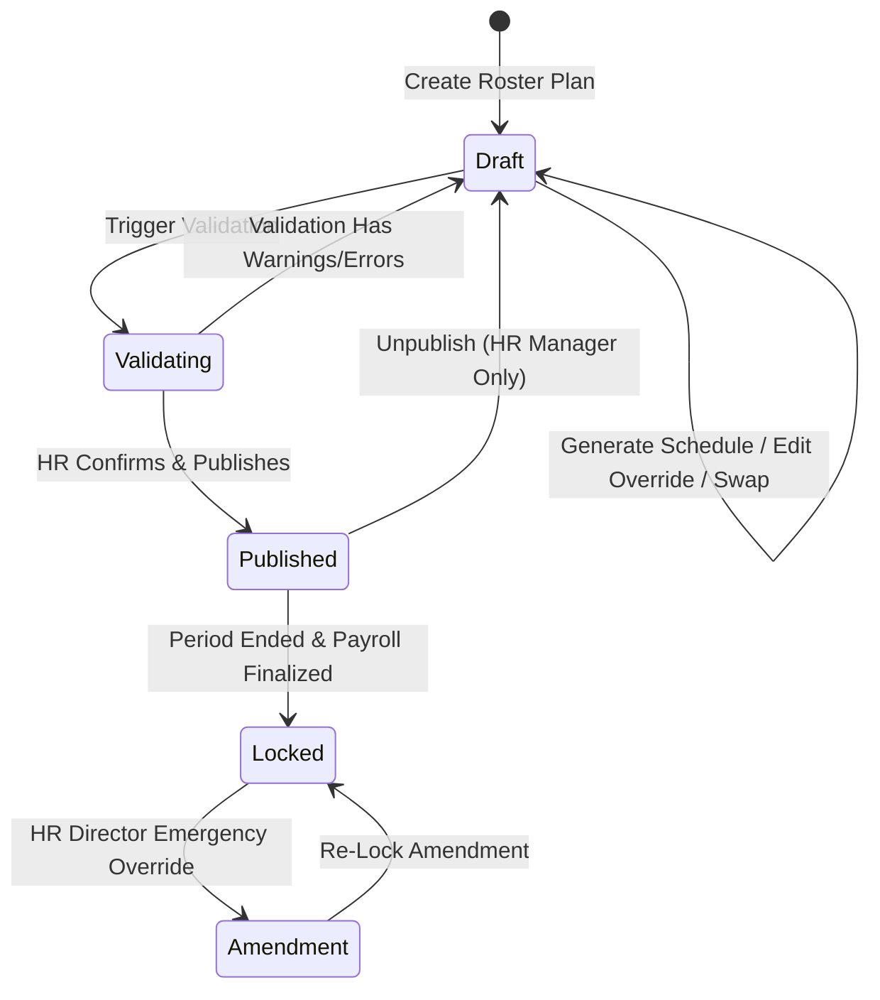
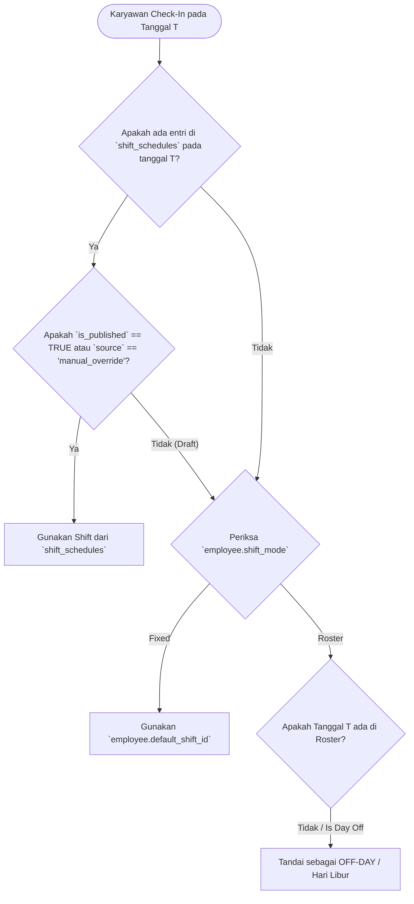

# Enterprise Architecture Blueprint: Shift & Roster Management Module
**Standard Compliance:** SAP SuccessFactors, Oracle HCM, Odoo ERP, ERPNext  
**Framework:** Laravel 12 Modular (`nwidart/laravel-modules`)  
**Target:** Scalable from SME to Enterprise (100,000+ Employees)

---

## 1. Executive Summary & Core Philosophy

Modul **Shift & Roster Management** dirancang dengan pendekatan **Enterprise Resource Planning (ERP)** standar industri dunia. Berbeda dengan aplikasi presensi sederhana, modul ini memisahkan secara tegas antara:
1. **Pola Kerja Statis (`Fixed Shift`)**: Menggunakan `default_shift` bawaan karyawan tanpa membebankan database dengan entri harian.
2. **Pola Kerja Bergilir (`Roster Shift`)**: Menggunakan kontainer **Roster Planning** berstatus **Draft $\rightarrow$ Published $\rightarrow$ Locked** dengan validasi cakupan (*Coverage & Soft Validation Engine*) sebelum dapat diakses oleh karyawan atau dibaca oleh mesin presensi/payroll.

---

## 2. Business Flow & State Diagram

### A. Business Lifecycle Flow
```
Shift Master & Patterns
       │
       ▼
Assign Employee Mode (Fixed / Roster)
       │
       ▼
Create Roster Plan (Container Period)
       │
       ▼
Generate Schedule (Pattern Engine / Mass Assignment) ──[ Status: DRAFT ]
       │
       ▼
Validate Coverage (Soft Validation Engine)
       ├── Incomplete / Warnings ──► Fix Missing Schedule / Overlaps
       └── Complete (0 Hard Error)
               │
               ▼
Publish Roster ──────────────────────────────────────[ Status: PUBLISHED ]
       │
       ├─► Mobile App (Employee can now view schedule)
       ├─► Attendance Engine (Shift resolution: 1. Schedule -> 2. Default)
       └─► Payroll Engine (Calculates late penalties, night shift allowances)
               │
               ▼
Lock Roster Period ──────────────────────────────────[ Status: LOCKED ]
```

### B. Roster Plan State Machine


---

## 3. Database Schema Design (ERD & Relations)

### A. Entity Relationship Diagram (ERD Summary)
- `shifts` (1) ─── (N) `shift_schedules`
- `roster_plans` (1) ─── (N) `shift_schedules`
- `employees` (1) ─── (N) `shift_schedules`
- `shift_teams` (1) ─── (N) `shift_team_members` ─── (1) `employees`
- `shift_rotation_patterns` (1) ─── (N) `roster_plans`
- `shift_swaps` (1) ─── (2) `employees` & (2) `shift_schedules`

### B. Table Definitions & Migrations

#### 1. `shifts` (Master Shift)
```sql
CREATE TABLE shifts (
    id UUID PRIMARY KEY,
    code VARCHAR(30) UNIQUE NOT NULL, -- e.g., 'SH-PGI', 'SH-MLM'
    name VARCHAR(100) NOT NULL, -- e.g., 'Morning Shift', 'Night Shift'
    start_time TIME NOT NULL, -- e.g., '08:00:00'
    end_time TIME NOT NULL, -- e.g., '17:00:00'
    break_start TIME NULL, -- e.g., '12:00:00'
    break_end TIME NULL, -- e.g., '13:00:00'
    is_cross_day BOOLEAN DEFAULT FALSE, -- TRUE jika shift malam lintas hari
    grace_period_minutes INT DEFAULT 15, -- Toleransi keterlambatan (menit)
    night_shift_allowance DECIMAL(15,2) DEFAULT 0.00, -- Tunjangan shift malam
    color_code VARCHAR(10) DEFAULT '#3B82F6', -- Hex code untuk UI kalender
    is_active BOOLEAN DEFAULT TRUE,
    created_at TIMESTAMP NULL,
    updated_at TIMESTAMP NULL,
    deleted_at TIMESTAMP NULL
);
```

#### 2. `roster_plans` (Container Roster Per Periode)
```sql
CREATE TABLE roster_plans (
    id UUID PRIMARY KEY,
    code VARCHAR(50) UNIQUE NOT NULL, -- e.g., 'RST-2026-09-PROD'
    name VARCHAR(150) NOT NULL, -- e.g., 'Roster Operasional Pabrik September 2026'
    department_id UUID NULL, -- Nullable jika berlaku lintas departemen
    shift_team_id UUID NULL, -- Nullable jika per divisi
    period_start DATE NOT NULL, -- e.g., '2026-09-01'
    period_end DATE NOT NULL, -- e.g., '2026-09-30'
    status ENUM('draft', 'published', 'locked', 'amendment') DEFAULT 'draft',
    total_employees INT DEFAULT 0,
    coverage_percentage DECIMAL(5,2) DEFAULT 0.00, -- Persentase kelengkapan (0-100%)
    warning_count INT DEFAULT 0,
    validation_summary JSON NULL, -- Cache hasil validasi terakhir
    created_by UUID NOT NULL, -- Referensi ke users/employees
    published_by UUID NULL,
    published_at TIMESTAMP NULL,
    locked_at TIMESTAMP NULL,
    created_at TIMESTAMP NULL,
    updated_at TIMESTAMP NULL,
    deleted_at TIMESTAMP NULL,
    FOREIGN KEY (created_by) REFERENCES users(id)
);
```

#### 3. `shift_schedules` (Jadwal Shift Harian Hasil Generate / Manual Override)
```sql
CREATE TABLE shift_schedules (
    id UUID PRIMARY KEY,
    roster_plan_id UUID NULL, -- NULL jika manual override di luar roster plan
    employee_id UUID NOT NULL,
    shift_id UUID NULL, -- NULL jika is_day_off = TRUE
    schedule_date DATE NOT NULL,
    is_day_off BOOLEAN DEFAULT FALSE,
    source ENUM('fixed_default', 'pattern_generated', 'manual_override', 'shift_swap') DEFAULT 'pattern_generated',
    original_shift_id UUID NULL, -- Menyimpan ID shift sebelum di-swap/override
    is_published BOOLEAN DEFAULT FALSE, -- Inherited dari roster_plans.status == 'published'
    notes TEXT NULL,
    created_at TIMESTAMP NULL,
    updated_at TIMESTAMP NULL,
    deleted_at TIMESTAMP NULL,
    UNIQUE(employee_id, schedule_date), -- Prevents duplicate schedule on same date
    FOREIGN KEY (roster_plan_id) REFERENCES roster_plans(id) ON DELETE CASCADE,
    FOREIGN KEY (employee_id) REFERENCES employees(id) ON DELETE CASCADE,
    FOREIGN KEY (shift_id) REFERENCES shifts(id) ON DELETE SET NULL
);
```

---

## 4. Roster Pattern Engine & Algoritma Generation

### A. Pattern Data Structure (JSON)
HR dapat mendefinisikan pola rotasi kompleks, contoh: **2 Morning, 2 Evening, 2 Night, 2 Off** (Siklus 8 Hari):

```json
[
  { "step": 1, "shift_code": "SH-PGI", "duration_days": 2, "is_day_off": false },
  { "step": 2, "shift_code": "SH-SNG", "duration_days": 2, "is_day_off": false },
  { "step": 3, "shift_code": "SH-MLM", "duration_days": 2, "is_day_off": false },
  { "step": 4, "shift_code": null,     "duration_days": 2, "is_day_off": true }
]
```

### B. Generation Algorithm (`GenerateRosterAction.php`)
1. Ambil seluruh karyawan ber-mode `roster` yang ditugaskan di `RosterPlan`.
2. Iterasi tanggal dari `period_start` sampai `period_end`.
3. Hitung selisih hari dari `pattern_start_date` untuk menentukan indeks langkah pola rotasi saat ini.
4. Gunakan `updateOrCreate` pada tabel `shift_schedules` agar entri berstatus `manual_override` tidak tertimpa (*preserve override integrity*).
5. Hitung persentase keterisian (*Coverage Percentage*).

---

## 5. Soft Validation & Coverage Engine

Sistem tidak melempar *hard exception* saat validasi agar HR dapat melihat daftar komprehensif dari semua isu dalam satu tampilan dashboard.

### Validation Rules Matrix

| Rule Code | Nama Validasi | Kondisi Warning | Tingkat Keparahan |
|:---|:---|:---|:---|
| `MISSING_SCHEDULE` | Jadwal Kosong | Karyawan roster tidak memiliki jadwal pada tanggal kerja | **HIGH** |
| `REST_TIME_VIOLATION` | Istirahat Kurang | Jeda antara jam selesai shift hari H dengan jam mulai shift H+1 $< 11$ jam | **HIGH** |
| `LEAVE_CONFLICT` | Bentrok Cuti | Karyawan memiliki cuti disetujui pada tanggal yang dijadwalkan shift | **MEDIUM** |
| `CONTRACT_EXPIRED` | Kontrak Kadaluarsa | Tanggal shift berada di luar tanggal aktif kontrak karyawan | **HIGH** |
| `CROSS_DAY_OVERLAP` | Overlap Shift Malam | Shift malam lintas hari bentrok dengan jam mulai shift keesokan harinya | **HIGH** |
| `SHIFT_SWAP_CONFLICT` | Bentrok Tukar Shift | Shift yang diswap tidak valid dengan status roster aktif | **MEDIUM** |

### Sample Validation Response JSON
```json
{
  "success": true,
  "message": "Validasi kelengkapan roster selesai diproses.",
  "data": {
    "roster_plan_id": "019fdb08-407f-727b-a01f-28923f37ceaa",
    "coverage_percentage": 97.45,
    "total_warnings": 3,
    "can_publish": true,
    "summary": {
      "missing_schedules": 1,
      "rest_time_violations": 1,
      "leave_conflicts": 1,
      "contract_expired": 0
    },
    "warnings": [
      {
        "code": "MISSING_SCHEDULE",
        "severity": "HIGH",
        "employee_id": "019fdb08-407f-727b-a01f-28923f37ce10",
        "employee_name": "Budi Setiawan",
        "date": "2026-09-15",
        "message": "Karyawan mode roster belum memiliki jadwal pada tanggal 15 Sep 2026."
      },
      {
        "code": "REST_TIME_VIOLATION",
        "severity": "HIGH",
        "employee_id": "019fdb08-407f-727b-a01f-28923f37ce11",
        "employee_name": "Siti Rahma",
        "date": "2026-09-18",
        "message": "Jeda istirahat antara Shift Malam (selesai 07:00) dan Shift Pagi (mulai 14:00) kurang dari 11 jam (Hanya 7 jam)."
      },
      {
        "code": "LEAVE_CONFLICT",
        "severity": "MEDIUM",
        "employee_id": "019fdb08-407f-727b-a01f-28923f37ce12",
        "employee_name": "Ahmad Rizky",
        "date": "2026-09-20",
        "message": "Karyawan memiliki Pengajuan Cuti Tahunan yang telah disetujui pada tanggal 20 Sep 2026."
      }
    ]
  }
}
```

---

## 6. Resolusi Hirarki Presensi & Penggajian

### A. Urutan Prioritas Resolusi Shift Presensi (`Attendance Resolution`)

Ketika karyawan melakukan check-in pada tanggal `T`, mesin presensi menentukan jam shift kerja dengan hirarki prioritas berikut:



### B. Integrasi Roster ke Modul Payroll

1. **Upah Lembur (Overtime Calculation)**:
   * Menentukan *Work Hours Limit* (misal 8 jam per shift).
   * Kelebihan jam kerja di luar jam selesai `shift_schedules` dikalkulasi sebagai lembur.
   * Lembur pada tanggal berstatus `is_day_off = true` dikalkulasi dengan pengali Lembur Hari Libur Depnaker (2x - 4x).
2. **Potongan Keterlambatan (Late Deduction)**:
   * Dihitung dari `start_time` di `shift_schedules` ditambah `grace_period_minutes`.
3. **Tunjangan Shift Malam (Night Shift Allowance)**:
   * Otomatis ditambahkan ke slip gaji jika karyawan bekerja pada shift dengan `is_cross_day = true`.

---

## 7. Architecture Folder Structure (Laravel Modular)

```text
Modules/HRCore/
├── app/
│   ├── Actions/
│   │   ├── GenerateRosterAction.php
│   │   ├── ValidateRosterPlanAction.php
│   │   ├── PublishRosterPlanAction.php
│   │   └── ProcessShiftSwapAction.php
│   ├── DTOs/
│   │   ├── RosterPlanDTO.php
│   │   └── ValidationReportDTO.php
│   ├── Http/
│   │   ├── Controllers/
│   │   │   ├── RosterPlanController.php
│   │   │   ├── ShiftScheduleController.php
│   │   │   └── ShiftSwapController.php
│   │   └── Requests/
│   │       ├── StoreRosterPlanRequest.php
│   │       └── ValidateRosterRequest.php
│   ├── Jobs/
│   │   └── BulkGenerateRosterJob.php
│   ├── Models/
│   │   ├── RosterPlan.php
│   │   ├── Shift.php
│   │   ├── ShiftSchedule.php
│   │   └── ShiftSwap.php
│   ├── Observers/
│   │   └── ShiftScheduleObserver.php
│   ├── Policies/
│   │   └── RosterPlanPolicy.php
│   ├── Repositories/
│   │   ├── Contracts/
│   │   │   └── RosterRepositoryInterface.php
│   │   └── Eloquent/
│   │       └── RosterRepository.php
│   └── Services/
│       ├── CoverageValidationService.php
│       ├── AttendanceShiftResolverService.php
│       └── ShiftRotationPatternService.php
├── database/
│   ├── migrations/
│   └── seeders/
└── routes/
    └── api.php
```

---

## 8. API Documentation (REST Endpoints)

| Method | Endpoint | Fungsi & Deskripsi |
|:---:|:---|:---|
| **GET** | `/api/v1/roster-plans/paginated` | List container Roster Plan terpaginasi beserta coverage % |
| **POST** | `/api/v1/roster-plans` | Membuat container Roster Plan baru (Status: `draft`) |
| **GET** | `/api/v1/roster-plans/{id}` | Detail Roster Plan & matriks ringkasan validasi |
| **POST** | `/api/v1/roster-plans/{id}/generate` | Me-run algoritma pembuatan jadwal otomatis massal |
| **POST** | `/api/v1/roster-plans/{id}/validate` | **Soft Validation Engine**: Mengembalikan daftar warning & coverage % |
| **POST** | `/api/v1/roster-plans/{id}/publish` | Mempublikasikan Roster Plan (Mobile App & Presensi aktif) |
| **POST** | `/api/v1/roster-plans/{id}/lock` | Mengunci Roster Plan setelah Payroll difinalisasi |
| **POST** | `/api/v1/shift-swaps` | Pengajuan tukar shift antar karyawan |
| **POST** | `/api/v1/shift-swaps/{id}/approve` | Persetujuan final 1-Level HR Admin untuk pertukaran shift |

---

## 9. Enterprise Edge Cases Handling

1. **Shift Malam Lintas Hari Kalender (Cross-Midnight Shift)**:
   * `start_time: 23:00`, `end_time: 07:00`.
   * Presensi check-out di hari keesokan kalender tetap dihubungkan ke `shift_schedule` tanggal hari sebelumnya.
2. **Mutasi Karyawan di Tengah Periode (Mid-Month Transfer)**:
   * Histori `work_schedule_assignments` menutup penugasan lama dan membuka penugasan baru tanpa merusak data presensi historis.
3. **Perubahan Roster Setelah Published (Amendment Control)**:
   * Jika HR mengubah shift setelah status `published`, entri tersebut ditandai `source = 'manual_override'` dan mencatat jejak audit di `audit_logs`.
