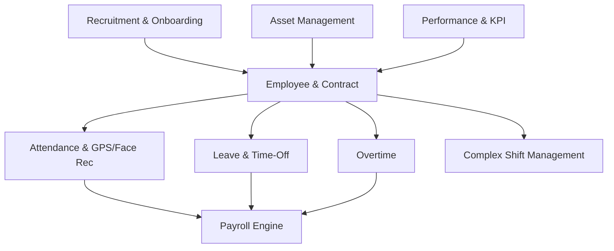

# Project Summary: Modular ERP System (HR Core Focus)

Dokumen ini memberikan gambaran umum (summary) arsitektur sistem ERP modular yang berfokus pada pilar **Human Resources (HR)**. Sistem ini dirancang untuk dapat berkembang secara bertahap (*scalable*) dari modul absensi inti hingga mencakup manajemen operasional perusahaan yang kompleks.

---

## 1. Arsitektur Umum & Teknologi

Sistem ERP ini dibangun menggunakan arsitektur terpisah (*decoupled*) dengan satu backend pusat dan multi-frontend yang disesuaikan dengan kebutuhan pengguna.

*   **Backend & API Server:** Laravel (PHP) + MySQL (Database Utama)
*   **Web Admin Panel (HR & Owner):** Vue.js
*   **Mobile App (Karyawan & Staff):** React Native (Expo)
*   **Face Recognition Microservice:** FastAPI (Python) + InsightFace

---

## 2. Struktur Modul & Hubungan Antar Modul

Setiap modul dirancang independen (menggunakan pendekatan modular di Laravel) namun tetap terintegrasi erat melalui relasi database. Berikut peta jalan modul yang akan diimplementasikan:

---

## 3. Ringkasan Modul HR ERP

Berikut adalah daftar modul yang akan dikembangkan beserta penjelasan ringkas dan keterkaitannya:

### 1. Attendance & Employee Contracts (Modul Utama)
*   **Deskripsi:** Pencatatan kehadiran mandiri via mobile app dengan verifikasi wajah (*InsightFace*) dan koordinat GPS (*Geofencing*), serta pencatatan riwayat kontrak karyawan (PKWT/PKWTT).
*   **Dokumen PRD:** [prd_attendance.md](file:///c:/laragon/www/ERP/docs/prd_attendance.md)

### 2. Payroll (Penggajian)
*   **Deskripsi:** Perhitungan gaji otomatis bulanan/mingguan berdasarkan kehadiran, potongan keterlambatan, uang lembur, potongan cuti di luar tanggungan, potongan BPJS, PPh 21, dan cetak slip gaji digital.
*   **Dokumen PRD:** [prd_payroll.md](file:///c:/laragon/www/ERP/docs/prd_payroll.md)

### 3. Leave & Time-Off (Manajemen Cuti & Izin)
*   **Deskripsi:** Pengajuan cuti tahunan, sakit dengan unggah surat dokter, izin khusus, dan izin setengah hari melalui aplikasi mobile dengan alur persetujuan bertingkat (*approval workflow*) oleh HR/Atasan.
*   **Dokumen PRD:** [prd_leave.md](file:///c:/laragon/www/ERP/docs/prd_leave.md)

### 4. Overtime (Lembur)
*   **Deskripsi:** Pengajuan pra-lembur dan klaim pasca-lembur oleh karyawan, validasi kesesuaian waktu lembur dengan log absensi aktual, serta kalkulasi otomatis upah lembur sesuai regulasi Depnaker.
*   **Dokumen PRD:** [prd_overtime.md](file:///c:/laragon/www/ERP/docs/prd_overtime.md)

### 5. Complex Shift Management (Manajemen Shift Kerja)
*   **Deskripsi:** Pengaturan jadwal kerja bergilir (*shifting*), roster kerja mingguan/bulanan, shift malam, pertukaran shift antar karyawan, dan toleransi keterlambatan khusus per shift.
*   **Dokumen PRD:** [prd_shift_management.md](file:///c:/laragon/www/ERP/docs/prd_shift_management.md)

### 6. Recruitment & Onboarding
*   **Deskripsi:** Manajemen lowongan pekerjaan internal/eksternal, pelacakan pelamar (Applicant Tracking System - ATS), penjadwalan wawancara, hingga konversi otomatis pelamar yang diterima menjadi data karyawan baru.
*   **Dokumen PRD:** [prd_recruitment.md](file:///c:/laragon/www/ERP/docs/prd_recruitment.md)

### 7. Asset Management (Manajemen Aset)
*   **Deskripsi:** Inventarisasi barang/alat kantor yang dipinjamkan ke karyawan (misal: laptop, kendaraan, HP), pelacakan tanggal pengembalian, status kondisi barang, dan form serah terima aset digital.
*   **Dokumen PRD:** [prd_asset.md](file:///c:/laragon/www/ERP/docs/prd_asset.md)

### 8. Performance Management (KPI & Penilaian Kerja)
*   **Deskripsi:** Penyusunan target Key Performance Indicator (KPI) karyawan, penilaian berkala (Self-Assessment, 360-degree feedback, Peer-review), dan laporan performa kerja untuk bahan evaluasi kenaikan jabatan/kontrak.
*   **Dokumen PRD:** [prd_performance.md](file:///c:/laragon/www/ERP/docs/prd_performance.md)

---

## 4. Rencana Rilis & Roadmap Pengembangan (Sprints)

Pengembangan sistem ERP HR ini akan dibagi menjadi 6 Sprint terencana guna mendapatkan umpan balik cepat dan meminimalkan tingkat kompleksitas debugging:

### Fase 1: MVP Absensi Non-AI (Sprint 1 - 3)
*   **Sprint 1: HR Core & Auth (Backend API)**
    *   Setup Laravel, Sanctum (Auth), dan Spatie (Roles & Permissions).
    *   Implementasi REST API Master: Departemen (koordinat & radius geofence), Jabatan, dan Master Karyawan.
*   **Sprint 2: Attendance API & Geofencing (Backend API)**
    *   REST API Absensi Masuk/Keluar (Check-in/Check-out).
    *   Validasi Geofencing koordinat GPS di server Laravel.
    *   Penyimpanan berkas foto selfie absensi di storage lokal.
    *   API Riwayat Kehadiran (Bulanan/Mingguan) dan dashboard monitoring HR.
*   **Sprint 3: Mobile Client Integration (React Native App)**
    *   Pembuatan modul login, profil, absensi (akses kamera HP & GPS perangkat), dan penayangan riwayat kehadiran karyawan.
    *   Uji coba alur absensi *end-to-end* (Karyawan absen di HP -> HR pantau di web).

### Fase 2: Integrasi AI & Modul Lanjutan (Sprint 4 - 6)
*   **Sprint 4: AI Face Recognition (FastAPI & InsightFace)**
    *   Setup microservice FastAPI dengan library InsightFace.
    *   API Registrasi wajah (*embedding extraction*) dan API Verifikasi wajah (*face matching & confidence score*).
    *   Integrasi API Laravel ke FastAPI.
*   **Sprint 5: Leave & Shift Management (Operational HR)**
    *   Modul manajemen cuti & izin langsung ke HR Admin.
    *   Modul manajemen roster shift kerja & persetujuan tukar shift karyawan.
*   **Sprint 6: Payroll Engine & HR Administration (Financial HR)**
    *   Manajemen Kontrak Kerja (PKWT/PKWTT).
    *   Kalkulasi gaji bulanan otomatis, potongan absensi, iuran BPJS, perhitungan PPh 21, dan cetak slip gaji digital.

---

## 5. Langkah Selanjutnya (Next Steps)
1.  **Database Design Review:** Meninjau kembali struktur database pada [database_design.md](file:///c:/laragon/www/ERP/docs/database_design.md) berdasarkan urutan pembuatan Sprint 1.
2.  **Setup Project Laravel:** Menginstal library `nwidart/laravel-modules` dan mulai merancang modul `HRCore` dan `Auth` untuk memenuhi target Sprint 1.

